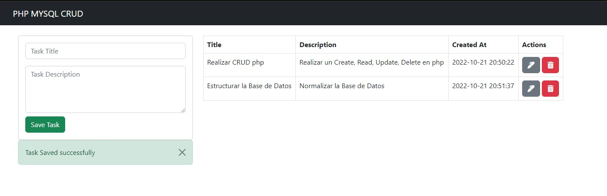

# First-CRUD-with-PHP
PHP 8 | Apache 2 | MySQL | WAMPServer

## Table of contents

- [Overview](#overview)
  - [Screenshot](#screenshot)
  - [Links](#links)
- [My process](#my-process)
  - [Built with](#built-with)
  - [What I learned](#what-i-learned)
  - [Continued development](#continued-development)
- [Author](#author)

## Overview

### Screenshot

### Links

- Solution URL: [Repository](https://github.com/AdhemarRomero/First-CRUD-with-PHP)

## My process

### Built with

- Semantic HTML5 markup
- Bootstrap
- Fontawesome
- PHP Language

### What I learned

In this project I reinforced that knowledge acquired in a self-taught way.

### Continued development

Just as I've learned things, I know I don't have clean code yet. So I will keep practicing to improve.

## Author

- LinkedIn - [Adhemar Romero](https://www.linkedin.com/in/adhemar-alessandro-romero-urbina/)
- GitHub - [AdhemarRomero](https://github.com/AdhemarRomero)